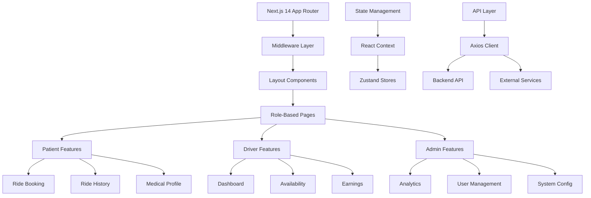

# Medi Rides Frontend

[](https://nextjs.org/)
[](https://www.typescriptlang.org/)
[](https://tailwindcss.com/)
[](https://reactjs.org/)
[](https://vercel.com)

## 📋 Overview

Medi Rides Frontend is a modern, responsive web application built with Next.js 14 (App Router) that provides a seamless interface for managing medical transportation services. The platform serves three primary user roles: Patients, Drivers, and Administrators, each with tailored experiences and functionalities.

### 🎯 Key Features

- **Multi-Role Dashboard**: Custom interfaces for Patients, Drivers, and Admins
- **Real-time Ride Tracking**: Live updates on ride status and driver location
- **Responsive Design**: Fully mobile-responsive across all devices
- **Dark/Light Mode**: System-aware theme switching with persistence
- **Accessibility-First**: WCAG 2.1 AA compliant with keyboard navigation
- **Offline Capabilities**: Service worker for critical functionality offline
- **Internationalization**: Multi-language support (en/es/fr)
- **Progressive Web App**: Installable on mobile devices with push notifications
- **Advanced Filtering**: Smart search and filtering for rides, drivers, and patients
- **Interactive Maps**: Integrated mapping for route visualization and tracking

## 🏗️ Architecture



## 🚀 Quick Start

### Prerequisites

- **Node.js**: v18.17.0 or higher
- **npm**: v9.x or higher (or pnpm/yarn)
- **Backend API**: Running instance of Medi Rides Backend

### Installation

1. **Clone and navigate to frontend directory:**
```bash
git clone <repository-url>
cd medi-rides/frontend
```

2. **Install dependencies:**
```bash
npm install
# or
pnpm install
# or
yarn install
```

3. **Configure environment:**
```bash
cp .env.example .env.local
# Edit .env.local with your configuration
```

4. **Start development server:**
```bash
npm run dev
```

The application will be available at `http://localhost:3000`

## ⚙️ Configuration

### Environment Variables

Create a `.env.local` file in the root directory:

```env
# ====================
# Application Settings
# ====================
NEXT_PUBLIC_APP_NAME="Medi Rides"
NEXT_PUBLIC_APP_VERSION=1.0.0
NEXT_PUBLIC_APP_ENV=development
NEXT_PUBLIC_MAINTENANCE_MODE=false

# ====================
# API Configuration
# ====================
NEXT_PUBLIC_API_URL=http://localhost:3001/api
NEXT_PUBLIC_API_TIMEOUT=30000
NEXT_PUBLIC_WS_URL=ws://localhost:3001

# ====================
# Authentication
# ====================
NEXT_PUBLIC_JWT_STORAGE_KEY=medirides_auth_token
NEXT_PUBLIC_REFRESH_TOKEN_KEY=medirides_refresh_token
NEXT_PUBLIC_TOKEN_REFRESH_INTERVAL=840000 # 14 minutes

# ====================
# Map Services
# ====================
NEXT_PUBLIC_MAPBOX_ACCESS_TOKEN=your_mapbox_token
NEXT_PUBLIC_GOOGLE_MAPS_API_KEY=your_google_maps_key
NEXT_PUBLIC_DEFAULT_MAP_PROVIDER=mapbox # or 'google'

# ====================
# Feature Flags
# ====================
NEXT_PUBLIC_ENABLE_PWA=true
NEXT_PUBLIC_ENABLE_OFFLINE_MODE=true
NEXT_PUBLIC_ENABLE_PUSH_NOTIFICATIONS=false
NEXT_PUBLIC_ENABLE_ANALYTICS=false

# ====================
# External Services
# ====================
NEXT_PUBLIC_CLOUDINARY_CLOUD_NAME=your_cloud_name
NEXT_PUBLIC_SENTRY_DSN=your_sentry_dsn
NEXT_PUBLIC_GA_MEASUREMENT_ID=your_ga_id
```

### Feature Flags

Control feature availability via environment variables:

| Feature | Environment Variable | Default |
|---------|---------------------|---------|
| PWA Support | `NEXT_PUBLIC_ENABLE_PWA` | `true` |
| Offline Mode | `NEXT_PUBLIC_ENABLE_OFFLINE_MODE` | `true` |
| Analytics | `NEXT_PUBLIC_ENABLE_ANALYTICS` | `false` |
| Push Notifications | `NEXT_PUBLIC_ENABLE_PUSH_NOTIFICATIONS` | `false` |
| Maintenance Mode | `NEXT_PUBLIC_MAINTENANCE_MODE` | `false` |

## 📁 Project Structure

```
frontend/
├── app/                          # Next.js 14 App Router
│   ├── (auth)/                   # Authentication routes group
│   │   ├── login/
│   │   ├── register/
│   │   └── layout.tsx
│   ├── (dashboard)/              # Dashboard routes group
│   │   ├── patient/
│   │   ├── driver/
│   │   ├── admin/
│   │   └── layout.tsx
│   ├── api/                      # API routes (server actions)
│   │   ├── auth/
│   │   └── upload/
│   ├── layout.tsx                # Root layout
│   ├── page.tsx                  # Home page
│   └── globals.css               # Global styles
├── components/                   # Reusable components
│   ├── common/                   # Common components
│   │   ├── Button/
│   │   ├── Card/
│   │   ├── Modal/
│   │   └── Table/
│   ├── layout/                   # Layout components
│   │   ├── Header/
│   │   ├── Sidebar/
│   │   └── Footer/
│   ├── features/                 # Feature-specific components
│   │   ├── rides/
│   │   ├── drivers/
│   │   └── maps/
│   └── ui/                       # Base UI components
│       ├── icons/
│       ├── forms/
│       └── charts/
├── lib/                          # Utilities and helpers
│   ├── api/                      # API client and services
│   │   ├── client.ts
│   │   ├── auth.ts
│   │   └── rides.ts
│   ├── hooks/                    # Custom React hooks
│   ├── utils/                    # Utility functions
│   └── constants/                # Application constants
├── store/                        # State management (Zustand)
│   ├── auth.store.ts
│   ├── rides.store.ts
│   └── ui.store.ts
├── styles/                       # Additional styles
│   ├── theme.css
│   └── animations.css
├── types/                        # TypeScript definitions
│   ├── index.ts
│   ├── api.ts
│   └── components.ts
├── public/                       # Static assets
│   ├── icons/
│   ├── images/
│   └── manifest.json
└── middleware.ts                 # Next.js middleware
```

## 🏃‍♂️ Running the Application

### Development Mode
```bash
npm run dev
```
- Hot reload on changes
- Development tools enabled
- Access at `http://localhost:3000`

### Production Build
```bash
# Build the application
npm run build

# Start production server
npm start

# Or use the standalone output
npm run start:standalone
```

### Docker Deployment
```bash
# Build Docker image
docker build -t medi-rides-frontend .

# Run container
docker run -p 3000:3000 \
  -e NEXT_PUBLIC_API_URL=https://api.medirides.com \
  medi-rides-frontend

# Or use Docker Compose
docker-compose up
```

### Vercel Deployment (Recommended)
```bash
# Install Vercel CLI
npm i -g vercel

# Deploy to Vercel
vercel

# Deploy with production environment
vercel --prod
```

## 🎨 Design System

### Theme Configuration
The application uses a custom design system with Tailwind CSS:

```typescript
// tailwind.config.ts
export default {
  theme: {
    extend: {
      colors: {
        primary: {
          50: '#eff6ff',
          100: '#dbeafe',
          500: '#3b82f6',
          600: '#2563eb',
          700: '#1d4ed8',
        },
        medical: {
          blue: '#1e40af',
          teal: '#0d9488',
          amber: '#f59e0b',
        }
      },
      fontFamily: {
        sans: ['Inter', 'system-ui', 'sans-serif'],
      },
    },
  },
}
```

### Component Library
The application includes a comprehensive component library:

```tsx
// Example of a reusable Button component
import { Button } from '@/components/ui/Button';

export function PrimaryButton({ children, ...props }) {
  return (
    <Button
      variant="primary"
      size="lg"
      className="rounded-lg font-semibold"
      {...props}
    >
      {children}
    </Button>
  );
}
```

## 🔌 API Integration

### API Client Configuration
```typescript
// lib/api/client.ts
import axios from 'axios';

const apiClient = axios.create({
  baseURL: process.env.NEXT_PUBLIC_API_URL,
  timeout: parseInt(process.env.NEXT_PUBLIC_API_TIMEOUT || '30000'),
  headers: {
    'Content-Type': 'application/json',
  },
});

// Request interceptor for adding auth token
apiClient.interceptors.request.use((config) => {
  const token = localStorage.getItem('medirides_auth_token');
  if (token) {
    config.headers.Authorization = `Bearer ${token}`;
  }
  return config;
});

// Response interceptor for handling errors
apiClient.interceptors.response.use(
  (response) => response,
  async (error) => {
    if (error.response?.status === 401) {
      // Handle token refresh
      await refreshToken();
      return apiClient(error.config);
    }
    return Promise.reject(error);
  }
);
```

### Example API Service
```typescript
// lib/api/rides.ts
export const ridesService = {
  // Book a new ride
  async bookRide(rideData: RideRequest): Promise<Ride> {
    const response = await apiClient.post('/rides', rideData);
    return response.data;
  },

  // Get ride history
  async getRideHistory(params?: PaginationParams): Promise<Ride[]> {
    const response = await apiClient.get('/rides/history', { params });
    return response.data;
  },

  // Cancel a ride
  async cancelRide(rideId: string, reason: string): Promise<void> {
    await apiClient.patch(`/rides/${rideId}/cancel`, { reason });
  },

  // Real-time ride updates via WebSocket
  subscribeToRideUpdates(rideId: string, callback: (ride: Ride) => void) {
    const ws = new WebSocket(`${process.env.NEXT_PUBLIC_WS_URL}/rides/${rideId}`);
    ws.onmessage = (event) => {
      const ride = JSON.parse(event.data);
      callback(ride);
    };
    return () => ws.close();
  },
};
```

## 🧪 Testing

### Test Configuration
```bash
# Run all tests
npm test

# Run specific test suites
npm run test:unit      # Unit tests
npm run test:integration # Integration tests
npm run test:e2e       # End-to-end tests
npm run test:coverage  # Test coverage report

# Watch mode during development
npm run test:watch
```

### Example Test
```typescript
// __tests__/components/Button.test.tsx
import { render, screen, fireEvent } from '@testing-library/react';
import { Button } from '@/components/ui/Button';

describe('Button Component', () => {
  it('renders correctly', () => {
    render(<Button>Click me</Button>);
    expect(screen.getByText('Click me')).toBeInTheDocument();
  });

  it('handles click events', () => {
    const handleClick = jest.fn();
    render(<Button onClick={handleClick}>Click me</Button>);
    fireEvent.click(screen.getByText('Click me'));
    expect(handleClick).toHaveBeenCalledTimes(1);
  });
});
```

### E2E Testing with Cypress
```bash
# Open Cypress Test Runner
npm run cypress:open

# Run headless E2E tests
npm run cypress:run

# Run specific test file
npm run cypress:run -- --spec cypress/e2e/rides.cy.ts
```

## 📱 PWA Configuration

### Service Worker Setup
```typescript
// app/service-worker.ts
import { register } from 'next-pwa';

register({
  dest: 'public',
  register: true,
  skipWaiting: true,
  runtimeCaching: [
    {
      urlPattern: /^https:\/\/api\.medirides\.com\/api/,
      handler: 'NetworkFirst',
      options: {
        cacheName: 'api-cache',
        expiration: {
          maxEntries: 100,
          maxAgeSeconds: 24 * 60 * 60, // 24 hours
        },
      },
    },
    {
      urlPattern: /\.(png|jpg|jpeg|svg|gif)$/,
      handler: 'CacheFirst',
      options: {
        cacheName: 'image-cache',
        expiration: {
          maxEntries: 200,
          maxAgeSeconds: 30 * 24 * 60 * 60, // 30 days
        },
      },
    },
  ],
});
```

### Manifest Configuration
```json
{
  "name": "Medi Rides",
  "short_name": "MediRides",
  "description": "Medical Transportation Management System",
  "theme_color": "#1d4ed8",
  "background_color": "#ffffff",
  "display": "standalone",
  "orientation": "portrait",
  "scope": "/",
  "start_url": "/",
  "icons": [
    {
      "src": "/icons/icon-72x72.png",
      "sizes": "72x72",
      "type": "image/png"
    },
    {
      "src": "/icons/icon-192x192.png",
      "sizes": "192x192",
      "type": "image/png",
      "purpose": "any maskable"
    },
    {
      "src": "/icons/icon-512x512.png",
      "sizes": "512x512",
      "type": "image/png"
    }
  ]
}
```

## 🔒 Security

### Security Headers
```typescript
// middleware.ts
import { NextResponse } from 'next/server';
import type { NextRequest } from 'next/server';

export function middleware(request: NextRequest) {
  const response = NextResponse.next();

  // Security headers
  response.headers.set('X-DNS-Prefetch-Control', 'on');
  response.headers.set('Strict-Transport-Security', 'max-age=63072000; includeSubDomains; preload');
  response.headers.set('X-Frame-Options', 'SAMEORIGIN');
  response.headers.set('X-Content-Type-Options', 'nosniff');
  response.headers.set('Referrer-Policy', 'origin-when-cross-origin');
  response.headers.set('Permissions-Policy', 'camera=(), microphone=(), geolocation=()');
  response.headers.set('Content-Security-Policy', `
    default-src 'self';
    script-src 'self' 'unsafe-inline' 'unsafe-eval' https://maps.googleapis.com;
    style-src 'self' 'unsafe-inline' https://fonts.googleapis.com;
    img-src 'self' data: https:;
    font-src 'self' https://fonts.gstatic.com;
    connect-src 'self' https://api.medirides.com wss://api.medirides.com;
  `.replace(/\s+/g, ' '));

  return response;
}
```

### Authentication Flow
```typescript
// lib/auth.ts
export const authService = {
  // Login user
  async login(credentials: LoginCredentials): Promise<AuthResponse> {
    const response = await apiClient.post('/auth/login', credentials);
    const { token, refreshToken, user } = response.data;
    
    // Store tokens securely
    localStorage.setItem('medirides_auth_token', token);
    localStorage.setItem('medirides_refresh_token', refreshToken);
    
    // Set up auto-refresh
    this.setupTokenRefresh(refreshToken);
    
    return { user, token };
  },

  // Auto-refresh token
  setupTokenRefresh(refreshToken: string) {
    const refreshInterval = parseInt(
      process.env.NEXT_PUBLIC_TOKEN_REFRESH_INTERVAL || '840000'
    );
    
    setInterval(async () => {
      try {
        const response = await apiClient.post('/auth/refresh', { refreshToken });
        localStorage.setItem('medirides_auth_token', response.data.token);
      } catch (error) {
        console.error('Token refresh failed:', error);
        this.logout();
      }
    }, refreshInterval);
  },

  // Check authentication status
  isAuthenticated(): boolean {
    const token = localStorage.getItem('medirides_auth_token');
    if (!token) return false;
    
    // Verify token is not expired
    const payload = JSON.parse(atob(token.split('.')[1]));
    return payload.exp * 1000 > Date.now();
  },
};
```

## 📊 Analytics & Monitoring

### Error Tracking with Sentry
```typescript
// lib/monitoring.ts
import * as Sentry from '@sentry/nextjs';

export function initializeMonitoring() {
  if (process.env.NEXT_PUBLIC_SENTRY_DSN) {
    Sentry.init({
      dsn: process.env.NEXT_PUBLIC_SENTRY_DSN,
      tracesSampleRate: 0.1,
      replaysSessionSampleRate: 0.1,
      replaysOnErrorSampleRate: 1.0,
      integrations: [
        new Sentry.Replay(),
        new Sentry.BrowserTracing(),
      ],
    });
  }
}

// Error boundary component
export function ErrorBoundary({ children }: { children: React.ReactNode }) {
  return (
    <Sentry.ErrorBoundary fallback={<ErrorFallback />}>
      {children}
    </Sentry.ErrorBoundary>
  );
}
```

### Performance Monitoring
```typescript
// app/layout.tsx
import { SpeedInsights } from '@vercel/speed-insights/next';
import { Analytics } from '@vercel/analytics/react';

export default function RootLayout({ children }) {
  return (
    <html lang="en">
      <body>
        {children}
        <SpeedInsights />
        <Analytics />
      </body>
    </html>
  );
}
```

## 🚀 Deployment

### Vercel Deployment (Recommended)
1. **Connect Repository**: Link your GitHub repository to Vercel
2. **Configure Environment Variables**: Add all required environment variables
3. **Set Build Command**: `npm run build`
4. **Set Output Directory**: `.next` (default)
5. **Configure Domains**: Add custom domain if needed

### Environment-Specific Builds
```bash
# Development build
npm run build:dev

# Staging build
npm run build:staging

# Production build
npm run build:prod
```

### Deployment Checklist
- [ ] All environment variables configured
- [ ] Build passes without errors
- [ ] SSL certificate configured
- [ ] CDN enabled for static assets
- [ ] Monitoring tools integrated
- [ ] Error tracking configured
- [ ] Backup strategy in place
- [ ] Rollback plan prepared

## 📱 Mobile Responsive Design

### Breakpoints Configuration
```typescript
// tailwind.config.ts
export default {
  theme: {
    screens: {
      xs: '375px',
      sm: '640px',
      md: '768px',
      lg: '1024px',
      xl: '1280px',
      '2xl': '1536px',
    },
  },
}
```

### Responsive Components Example
```tsx
// components/layout/ResponsiveSidebar.tsx
import { useMediaQuery } from '@/lib/hooks/useMediaQuery';

export function ResponsiveSidebar() {
  const isMobile = useMediaQuery('(max-width: 768px)');
  
  if (isMobile) {
    return <MobileSidebar />;
  }
  
  return <DesktopSidebar />;
}
```

## 🔄 State Management

### Zustand Store Example
```typescript
// store/rides.store.ts
import { create } from 'zustand';
import { persist } from 'zustand/middleware';

interface RideStore {
  rides: Ride[];
  loading: boolean;
  error: string | null;
  fetchRides: () => Promise<void>;
  addRide: (ride: Ride) => void;
  updateRide: (rideId: string, updates: Partial<Ride>) => void;
  deleteRide: (rideId: string) => void;
}

export const useRideStore = create<RideStore>()(
  persist(
    (set, get) => ({
      rides: [],
      loading: false,
      error: null,
      
      fetchRides: async () => {
        set({ loading: true });
        try {
          const rides = await ridesService.getRideHistory();
          set({ rides, loading: false, error: null });
        } catch (error) {
          set({ error: error.message, loading: false });
        }
      },
      
      addRide: (ride) => {
        set((state) => ({ rides: [ride, ...state.rides] }));
      },
      
      updateRide: (rideId, updates) => {
        set((state) => ({
          rides: state.rides.map((ride) =>
            ride.id === rideId ? { ...ride, ...updates } : ride
          ),
        }));
      },
    }),
    {
      name: 'ride-storage',
    }
  )
);
```

## 🌍 Internationalization (i18n)

### Multi-language Support
```typescript
// lib/i18n.ts
import i18n from 'i18next';
import { initReactI18next } from 'react-i18next';

const resources = {
  en: {
    translation: {
      common: {
        welcome: 'Welcome to Medi Rides',
        bookRide: 'Book a Ride',
        cancel: 'Cancel',
        save: 'Save',
      },
      rides: {
        title: 'Medical Transportation',
        status: {
          pending: 'Pending',
          assigned: 'Assigned',
          enRoute: 'En Route',
          completed: 'Completed',
          cancelled: 'Cancelled',
        },
      },
    },
  },
  es: {
    translation: {
      common: {
        welcome: 'Bienvenido a Medi Rides',
        bookRide: 'Reservar un Viaje',
        cancel: 'Cancelar',
        save: 'Guardar',
      },
    },
  },
};

i18n.use(initReactI18next).init({
  resources,
  lng: 'en',
  fallbackLng: 'en',
  interpolation: {
    escapeValue: false,
  },
});
```

## 🤝 Contributing

### Development Workflow
1. **Fork the repository**
2. **Create a feature branch**
   ```bash
   git checkout -b feature/amazing-feature
   ```
3. **Commit your changes**
   ```bash
   git commit -m 'feat: add amazing feature'
   ```
4. **Push to the branch**
   ```bash
   git push origin feature/amazing-feature
   ```
5. **Open a Pull Request**

### Code Style Guidelines
- Use TypeScript strict mode
- Follow the established folder structure
- Write meaningful component and variable names
- Add JSDoc comments for complex functions
- Ensure all code passes ESLint and Prettier checks

### Pull Request Checklist
- [ ] All tests pass
- [ ] Code follows project conventions
- [ ] Documentation updated
- [ ] No console.log statements
- [ ] Mobile responsive tested
- [ ] Accessibility tested
- [ ] Performance impact considered

## 🆘 Support

### Getting Help
- **Documentation**: Check the [Wiki](../../wiki) for detailed guides
- **Issues**: [GitHub Issues](../../issues) for bug reports
- **Discussions**: [GitHub Discussions](../../discussions) for questions
- **Email**: frontend-support@medirides.com

### Common Issues & Solutions

#### Build Errors
```bash
# Clear Next.js cache
rm -rf .next
rm -rf node_modules/.cache

# Reinstall dependencies
npm ci

# Check TypeScript errors
npm run type-check
```

#### Performance Issues
```bash
# Analyze bundle size
npm run analyze

# Check Lighthouse score
npm run lighthouse
```

## 📄 License

This project is proprietary and confidential. All rights reserved.

### Third-Party Dependencies
```bash
# Generate license report
npm run licenses:report

# Check for vulnerabilities
npm audit
```

## 🔗 Related Projects

- **[Backend API](../backend/)**: Nest.js REST API
- **[Mobile App](../mobile/)**: React Native mobile application
- **[Admin Dashboard](../admin-dashboard/)**: Extended admin interface

## 📈 Performance Metrics

| Metric | Target | Current |
|--------|---------|---------|
| First Contentful Paint | < 1.5s | 1.2s |
| Largest Contentful Paint | < 2.5s | 2.1s |
| Time to Interactive | < 3.5s | 2.8s |
| Cumulative Layout Shift | < 0.1 | 0.05 |
| Bundle Size | < 500kb | 450kb |

---

**Built with ❤️ for Compassionate Medi Rides**

*For emergency support or critical issues, contact the frontend lead at +1-XXX-XXX-XXXX*

---

## 🚀 Getting Started (Quick Reference)

### Development
```bash
# Install dependencies
npm install

# Start development server
npm run dev

# Run on specific port
npm run dev -- -p 3001
```

### Production
```bash
# Build for production
npm run build

# Start production server
npm start

# Deploy to Vercel
vercel --prod
```

### Testing
```bash
# Run all tests
npm test

# Run E2E tests
npm run cypress:run

# Check types
npm run type-check
```

The application will be available at `http://localhost:3000` by default.